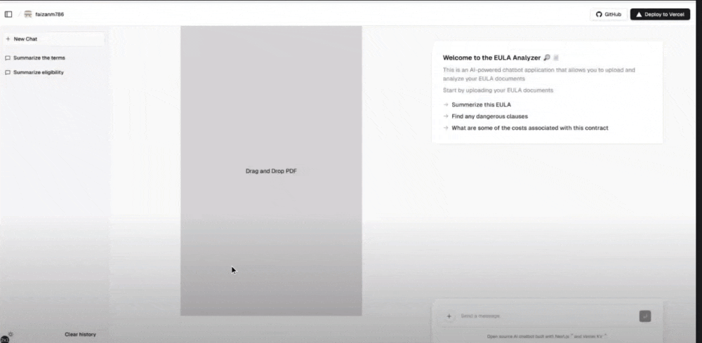
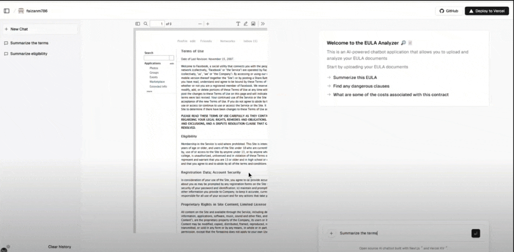

# Ask Contract 📄🔎

**Ask-Contract** is an AI-powered document analyzer and chat application designed to help users understand and interact with legal documents. Simply upload your document and ask questions about its content in real-time.

## 🚀 Features

- **User Authentication**: Sign in securely using your GitHub account to access all features.
- **Intuitive Design**: Upload your document and view it alongside a live chat interface for seamless interactions.
- **CRUD Functionality**: Manage your previous chats with options to create, view, edit, and delete conversations.
- **Intent Classification**: Only relevant legal domain questions are answered, providing accurate and useful responses.

## 🛠️ Built With

- **Frontend**: Developed with TypeScript, React, LangChain, and Next.js for a fast, scalable, and user-friendly interface.
- **Backend**: Powered by TypeScript, with a REST API built on Node.js for robust server-side operations.
- **Databases**: Uses Pinecone Database for vector storage and Vercel Database for other data needs.
- **Deployment**: Hosted on Vercel for easy and efficient server-side deployment.

## 🖥️ Demo

